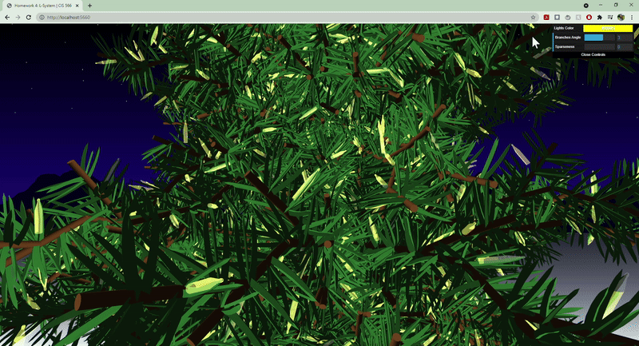
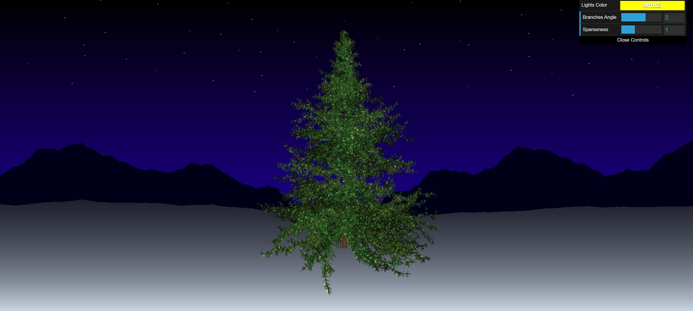

# CIS 566 Homework 4: L-systemss
Sharon Dong (PennKey: sharondo)

## L-system
- The tree is created using 5 different expansion rules and many, many drawing rules
- Many drawing operations use randomness to pick an angle that will control how to draw a branch or pine needle
- There are 3 different objs used 

Helpful links:
http://paulbourke.net/fractals/lsys/

## Modifiable Features
- Color of the lights
- Angle of the tree branches changes by setting the angle of drawing rules

Angle level 0             |  Angle level 5
:-------------------------:|:-------------------------:
  |  

- Spareseness of the pine needles changes by adding symbols to expansion rules

Spareseness level 1        |  Spareseness level 2
:-------------------------:|:-------------------------:
  |  

## Background

