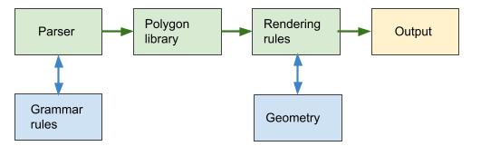

Sharon Dong and David Li

# Introduction
We are both interested in experimenting and learning about shape grammars, as it is a super cool extension of L-systems! Due to the time constraints of this project, we thought that the style of Greek villas would be a reasonable visual target for our building generator as they are relatively simple boxy structures, but they still have a cohesive style.

# Goal
Our goal is to create a building generator using shape grammars implemented with Typescript and WebGL.

# Inspiration/reference
Greek villas

 

# Specification
For our first milestone, we plan to create a simpler building generator that basically merges and organizes different shapes together, without worrying about layouts or subdividing geometry. This will involve:
- Grammar rules- rules for how different shapes connect together
- Rendering rules- rules for which models, colors, and reflection types to use for different shapes 
- Parser - the parser will go through the set and replace symbols using the set of grammar rules
- Geometry - models for different polygons that will be used 

As a stretch goal, we would like to implement the ability to subdivide geometry, such as creating floors from walls, and wall units with windows from floors. These rules would be part of grammar rules refactored into a polygon library.
- Polygon Library - a series of functions that perform operations such as geometry subdivision 

# Techniques
L-systems: https://cis566-procedural-graphics.github.io/lsystems.pdf

Shape-grammars: https://cis566-procedural-graphics.github.io/shape_grammar.pdf

# Design

# Timeline
Week 1:
- David: Model three simple shapes for use. Write rules to place these shapes
- Sharon: Refactor L-system code to use a shape grammar parser

Week 2: 
- David: Refine grammar rules and help develop rendering rules
- Sharon: Refactor rendering rules to fit shape grammars

Week 3:
- David: Bug fixes, polygon library, subdivision
- Sharon: Bug fixes, polygon library, cut out
