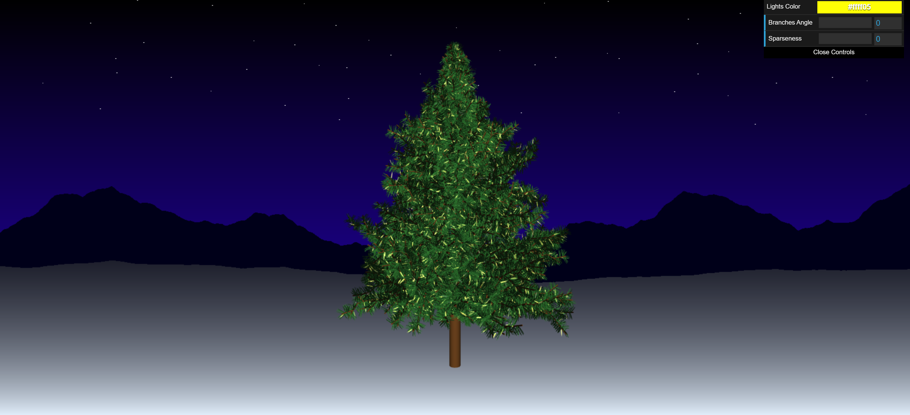
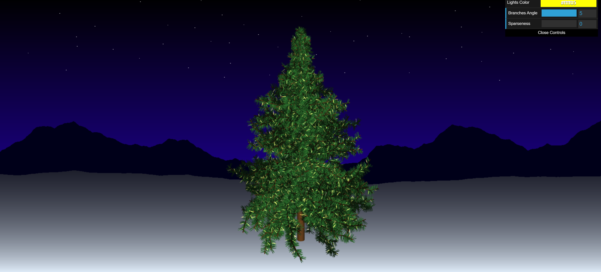
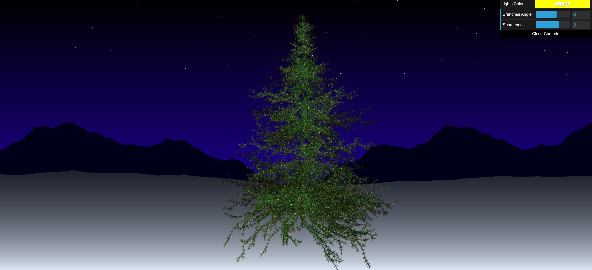

# CIS 566 Homework 4: L-systemss
Sharon Dong (PennKey: sharondo)

Live Demo: https://sharond106.github.io/hw04-l-systems/  

## Tree Implementation
- The tree is created using 5 different expansion rules and many, many drawing rules. I started with a set of rules from http://paulbourke.net/fractals/lsys/, and then modified it to what I wanted. Then I translated this into 3D.

Original            |  Modified
:-------------------------:|:-------------------------:
  |  

- Many drawing operations use randomness to pick an angle that will control how to draw a branch or pine needle
- There are 3 different objs used for: trunk/branch, pine needle, light
- The lights are animated by creating a grid over the screen and mapping each fragment's position to a grid square in order to attempt to group fragments on the same light together. Then I animate each grid square based on a random value to get the appearance of flickering lights.

## Modifiable Features
- Color of the lights
- Angle of the tree branches changes by setting the angle of drawing rules

Angle level 0             |  Angle level 5
:-------------------------:|:-------------------------:
  |  

- Spareseness of the pine needles changes by adding symbols to expansion rules

Spareseness level 1        |  Spareseness level 2
:-------------------------:|:-------------------------:
  |  

## Backdrop
- Stars placed with voronoi points
- Mountain range and horizon line sillouettes created with 1D fbm
- Sky and ground gradient interpolated with bias function
