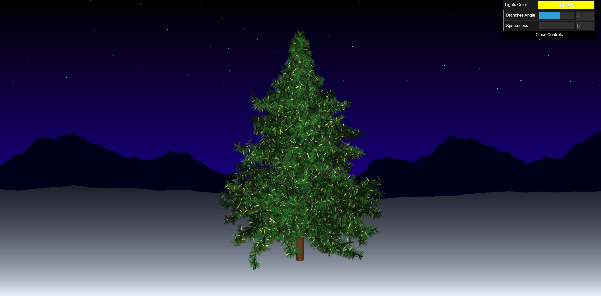

# CIS 566 Homework 4: L-systemss
Sharon Dong (PennKey: sharondo)

## Modifiable Features
- Color of the lights
- Angle of the tree branches
- Spareseness of the tree leaves

Helpful links:
http://paulbourke.net/fractals/lsys/

