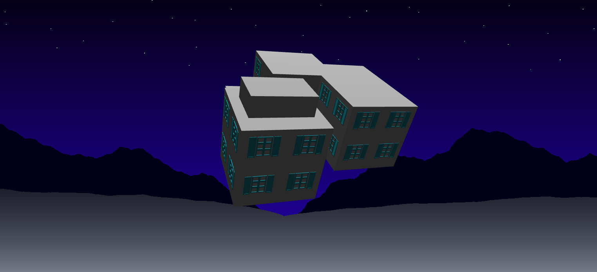

Sharon Dong and David Li

# Introduction
We are both interested in experimenting and learning about shape grammars, as it is a super cool extension of L-systems! Due to the time constraints of this project, we thought that the style of Greek villas would be a reasonable visual target for our building generator as they are relatively simple boxy structures, but they still have a cohesive style.

# Goal
Our goal is to create a building generator using shape grammars implemented with Typescript and WebGL.

# Inspiration/reference
Greek villas

 

# Specification
For our first milestone, we plan to create a simpler building generator that basically merges and organizes different shapes together, without worrying about layouts or subdividing geometry. This will involve:
- Grammar rules- rules for how different shapes connect together
- Rendering rules- rules for which models, colors, and reflection types to use for different shapes 
- Parser - the parser will go through the set and replace symbols using the set of grammar rules
- Geometry - models for different polygons that will be used 

As a stretch goal, we would like to implement the ability to subdivide geometry, such as creating floors from walls, and wall units with windows from floors. These rules would be part of grammar rules refactored into a polygon library.
- Polygon Library - a series of functions that perform operations such as geometry subdivision 

# Techniques
L-systems: https://cis566-procedural-graphics.github.io/lsystems.pdf

Shape-grammars: https://cis566-procedural-graphics.github.io/shape_grammar.pdf

# Design

# Timeline
Week 1:
- David: Model three simple shapes for use. Write rules to place these shapes
- Sharon: Refactor L-system code to use a shape grammar parser

Week 2: 
- David: Refine grammar rules and help develop rendering rules
- Sharon: Refactor rendering rules to fit shape grammars

Week 3:
- David: Bug fixes, polygon library, subdivision
- Sharon: Bug fixes, polygon library, cut out

# Milestone 2
Implemented
- Modeled geometry to use: 3 different sizes of cubes, 1 window + shutters
- Created grammar rules that position and scale cubes to represent the main shape of the building
- Implemented shape grammar parser with instanced rendering for each of the meshes
- Started implementing polygon library and able to draw windows on top of a wall. Depending on the scale of the wall, multiple rows/cols of windows will be generated

Future plans
- Implement a way to handle intersections between windows and cubes
- Possibly change the grammar rules
- Add colors and shading
- Add other decorative meshes
- Add features to polygon library to be able to subdivide meshes in other ways
- Create scene/background for building
- Add GUI elements

Example generations

 

# Milestone 3
Implemented
- Intersection detector to better determine when to add windows: To do this, we came up with an algorithm that uses the idea of SDFs from ray marching. After splitting a wall into possible window locations, we test the 4 corners of the window to see if it lies within any other shapes. Although this requires iterating through every shape, there are not that many shapes in our final building. After solving many tedious bugs, this method is still not working all the time, but we are trying to figure out why! 
- Door mesh and new window mesh modeled: We place all the windows first, and then we randomly select a window on the first floor and replace it with a door. 
- Option to set color of different shapes added
- Grammar rules improved to yield more interesting buildings

Future plans
- Fix intersection testing bugs
- Improve the grammar rules
- Add texturing
- Add lighting
- Make meshes look more Greek villa like (bevel edges)
- Create scene/background for building
- Add GUI elements

Example generations 2

 

# Final Renders
Implemented
- Fixed some intersection testing bugs
- Improved grammar rules to add more height contrast 
- Added extra window mesh
- Gamma lighting and contrast
- Added terraces 
- Changed background 
- GUI can change different colors, the number of shape grammar iterations, and the probabilty that windows are placed 

